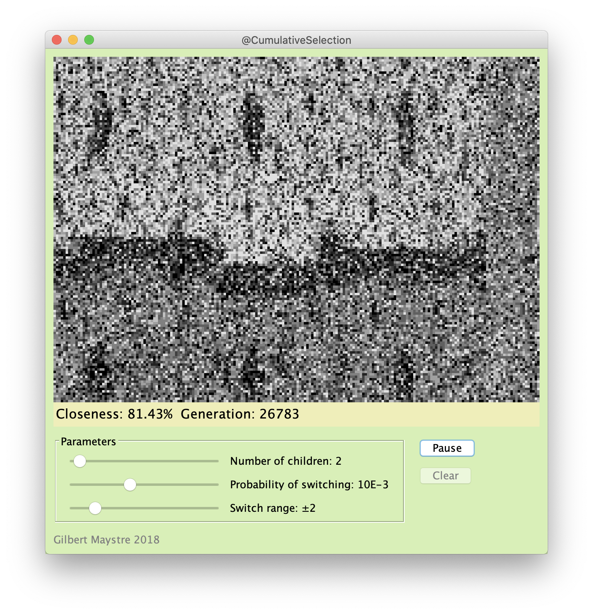
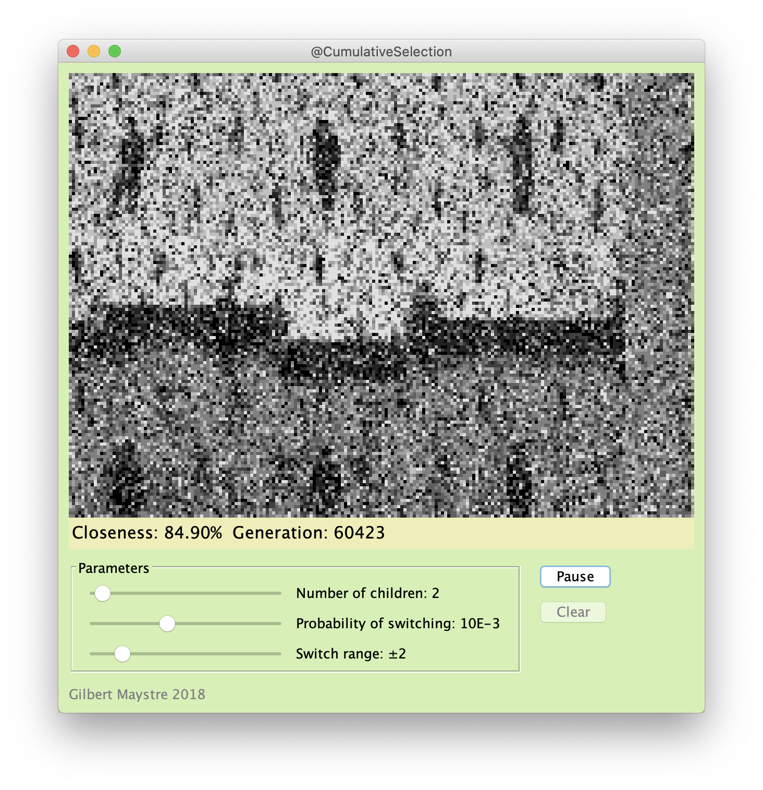
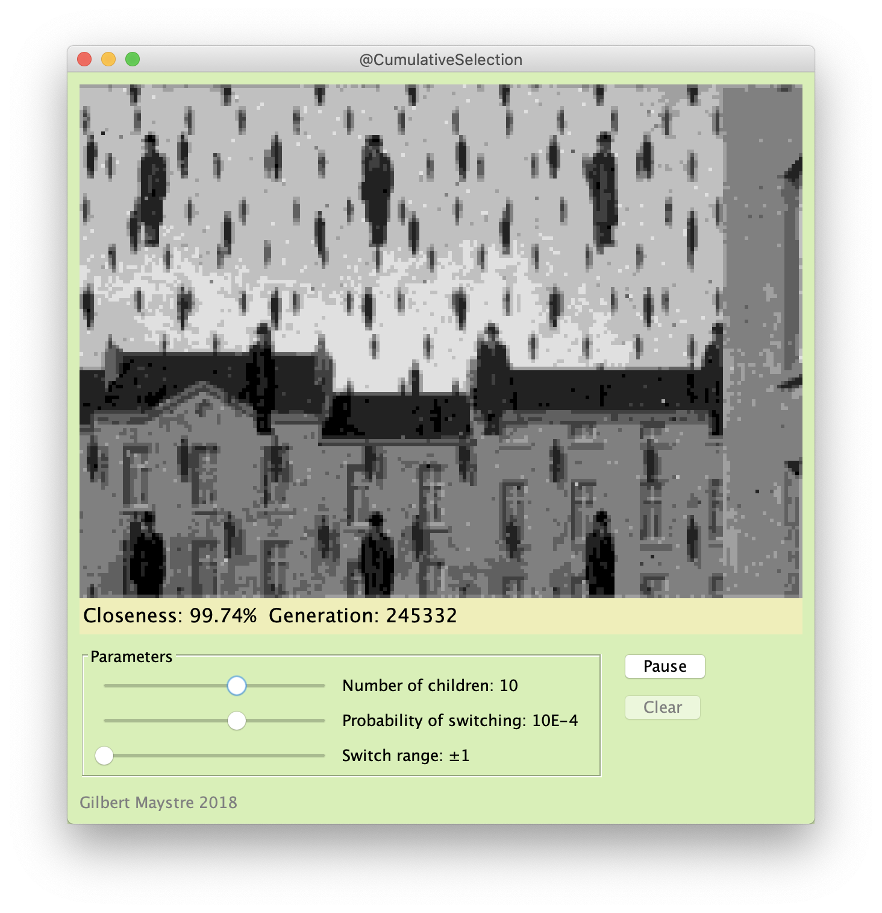
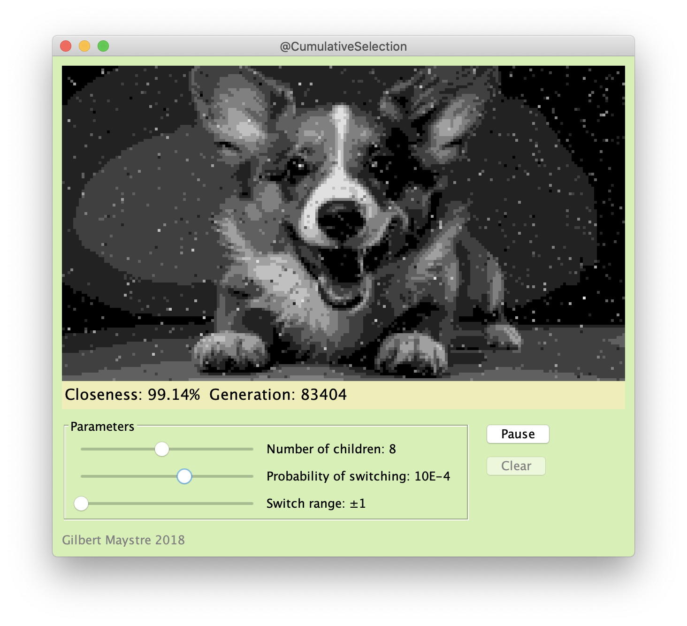

# Genetic algorithms: a visual experiment

A [genetic algorithm](https://en.wikipedia.org/wiki/Genetic_algorithm) is a heuristic to find an optimal solution whithin a (large) search space. This app features a visual step-by-step run of a genetic algorithm.
1. It starts with a target picture (e.g. a Magrite painting) which is the "ideal solution" and a current candidate which is fully random.
2. At every generation, a number of children are created which have "random mutation" with respect to the previous iteration
3. The best (closest to target picture) children is kept and the process continues

__How fast does this process converges to the target picture?__

## How to Run

1. Make sure you have Java installed
2. Double click on CumulativeSelection.jar
3. Alternatively, run ```java -jar <path/to/jar> <path/to/your/target/picture>```

You can control the number of children per generation as well as how the mutation are performed.

## Code Highlights

The genetic algorithm is located in the ```PictureCumulator.java``` file

## Sample Screenshots

   
